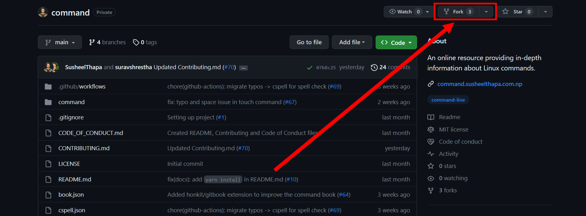

# Contributing to `command`

Thank you for your interest in contributing to `command`! We welcome contributions from the community to make this project even better.

Please take a moment to review this document to understand how you can contribute.

## Table of Contents

- [Contributing to Project Name](#contributing-to-project-name)
  - [Table of Contents](#table-of-contents)
  - [Ways to Contribute](#ways-to-contribute)
  - [Getting Started](#getting-started)
    - [Fork the Repository](#fork-the-repository)
    - [Clone Your Fork](#clone-your-fork)
    - [Create a Branch](#create-a-branch)
    - [Make Changes](#make-changes)
    - [Commit Your Changes](#commit-your-changes)
    - [Push Your Changes](#push-your-changes)
    - [Create a Pull Request](#create-a-pull-request)
  - [Guidelines](#guidelines)
  - [Code of Conduct](#code-of-conduct)
  - [License](#license)

## Ways to Contribute

There are several ways you can contribute to [Project Name]:

- **Bug Reports**: If you encounter a bug or issue, please open a new issue on the GitHub repository.

- **Feature Requests**: You can suggest new features or improvements by opening a feature request issue.

- **Code Contributions**: If you're interested in fixing issues or implementing new features, you can submit a pull request.

- **Documentation**: Help us improve documentation by fixing errors, clarifying explanations, or adding new content.

## Getting Started

Here are the steps to follow when making contributions:

### Fork the Repository

Click the "Fork" button on the GitHub repository to create your own copy of the project.



> Sam has forked the repository in Github.

### Clone Your Fork

```bash
git clone https://github.com/yourusername/command.git
```

> _git clone https://github.com/sam/command.git_

### Create a Branch

```bash
git checkout -b your-branch-name
```

> _git checkout -b tar_

### Make Changes

Make your changes to the code, documentation, or other project files with reference to this [discussion](https://github.com/SusheelThapa/command/discussions/7).

> Sam add documentation for the `tar` command.

### Commit your Changes

```bash
git commit -m "Description of your changes"
```

> _git commit -m "docs: added documentation on tar command"_

### Push you changes

Push your changes to you fork on Github:

```bash
git push -u origin your-branch-name
```

> _git push -u origin tar_

### Create a Pull Request

Go to the GitHub repository and create a pull request. Please provide a clear title, description, and link to any related issues.

To help us categorize and prioritize your PR, please use the following labels in the title of your PR (if applicable):

- `docs`: for documentation changes or additions.
- `fix`: for bug fixes.
- `feat`: for new features or enhancements.

Example PR titles:

- docs: Updated installation guide
- fix: Resolved issue with X
- feat: Added new user authentication feature

## Guidelines

- Follow the coding style and standards used in the project.

- Make sure your contributions are well-documented and tested.

- Respect the existing codebase, and avoid introducing breaking changes.

- Be open to feedback and be willing to make changes to your contributions.

## Code of Conduct

Please review our [Code of Conduct](./CODE_OF_CONDUCT.md) to understand the behaviours expected from contributors.
